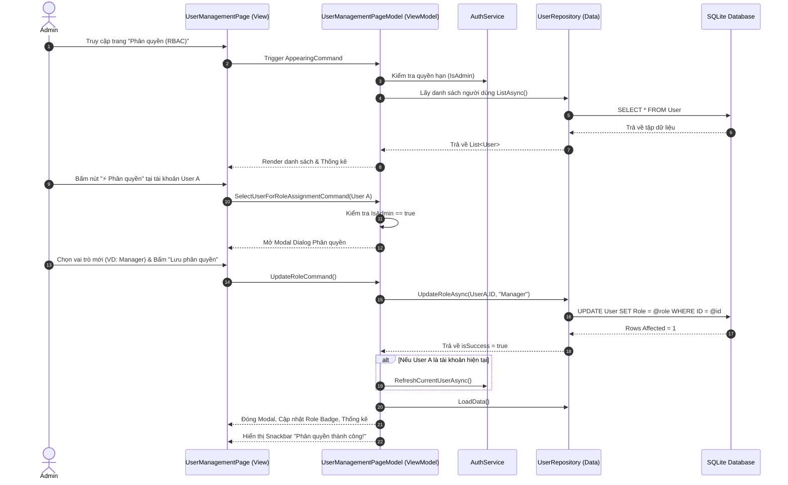

# TÀI LIỆU PHÂN TÍCH YÊU CẦU NGHIỆP VỤ (BUSINESS ANALYSIS DOCUMENT)

---

## THÔNG TIN TÀI LIỆU (DOCUMENT INFORMATION)

| Mục | Nội dung |
| :--- | :--- |
| **Tên dự án** | Hệ Thống Quản Lý Hoạt Động Ngoại Khóa Sinh Viên (*Campus Activities Manager*) |
| **Phân hệ / Module** | Quản Lý Người Dùng & Phân Quyền Truy Cập (*User Management & Role-Based Access Control - RBAC*) |
| **Mã nghiệp vụ** | **AC 05.3.1 (Phân quyền thành công)** |
| **Tài liệu tham chiếu** | SRS - Software Requirement Specification / BRD - Business Requirement Document |
| **Phiên bản (Version)**| 1.0.0 |
| **Trạng thái** | Phê duyệt & Sẵn sàng triển khai (Approved & Ready for Implementation) |
| **Nền tảng mục tiêu** | .NET MAUI (C# 12, MVVM, SQLite Database) |

---

## 1. TỔNG QUAN NGHIỆP VỤ (BUSINESS OVERVIEW)

### 1.1. Bối cảnh (Background)
Trong môi trường trường học, các hoạt động phong trào, tình nguyện và nghiên cứu khoa học có sự tham gia của nhiều nhóm đối tượng khác nhau: Ban Quản trị hệ thống, Ban Tổ chức / Quản lý hoạt động và Sinh viên. Để đảm bảo tính an toàn dữ liệu, phân định rõ trách nhiệm và ngăn chặn các thao tác trái thẩm quyền, hệ thống cần một cơ chế phân quyền truy cập theo vai trò (Role-Based Access Control - RBAC).

### 1.2. Mục tiêu (Business Objectives)
- Cung cấp cơ chế quản lý vai trò tập trung, minh bạch và an toàn.
- Đảm bảo **chỉ tài khoản mang vai trò Admin** mới có quyền gán, thay đổi vai trò hoặc thu hồi quyền hạn của các tài khoản khác.
- Lưu trữ bền vững dữ liệu phân quyền vào Cơ sở dữ liệu SQLite cục bộ, đảm bảo tính toàn vẹn dữ liệu ngay cả khi ứng dụng khởi động lại hoặc hoạt động ngoại tuyến (Offline).
- Đồng bộ tức thì trạng thái phiên làm việc (Session) của tài khoản sau khi được phân quyền lại.

### 1.3. Phạm vi (Scope)
- **Trong phạm vi (In-Scope):**
  - Quản lý danh sách người dùng và vai trò hiện tại.
  - Phân quyền người dùng sang 1 trong 3 vai trò: `Admin`, `Manager`, `Student`.
  - Kiểm tra và chặn quyền nếu người thực hiện không phải là Admin.
  - Cập nhật trực tiếp và lưu trữ vào CSDL SQLite.
  - Phản hồi kết quả phân quyền qua giao diện (Snackbar/Toast) và làm mới thẻ thống kê.
- **Ngoài phạm vi (Out-of-Scope):**
  - Phân quyền chi tiết theo nhóm hành động (Permission/Claim-based level) từng nút bấm đơn lẻ (giai đoạn tiếp theo).
  - Tích hợp đăng nhập Single Sign-On (SSO) qua cổng thông tin trường.

---

## 2. CÁC TÁC NHÂN & MA TRẬN PHÂN QUYỀN (ACTORS & PERMISSION MATRIX)

### 2.1. Danh sách tác nhân (Actors)

| Tác nhân (Actor) | Mã vai trò (Role Code) | Mô tả quyền hạn & Trách nhiệm |
| :--- | :--- | :--- |
| **Quản trị viên** | `Admin` | Toàn quyền trên hệ thống. Có quyền phân quyền người dùng, quản lý cấu hình danh mục (`Category`), thẻ (`Tag`), dự án (`Project`) và tài khoản. |
| **Quản lý hoạt động** | `Manager` | Quản lý các dự án, hoạt động và nhiệm vụ sinh viên. **Không** có quyền truy cập chức năng phân quyền hoặc cấu hình hệ thống. |
| **Sinh viên** | `Student` | Thành viên tham gia. Xem danh sách hoạt động, nhận nhiệm vụ và đánh dấu hoàn thành nhiệm vụ cá nhân. Chỉ có quyền đọc (Read-only) trong module người dùng. |

### 2.2. Ma trận phân quyền (RBAC Matrix)

| Chức năng / Hành động | Admin | Manager | Student |
| :--- | :---: | :---: | :---: |
| **Xem danh sách người dùng & vai trò** |  (Xem & Quản trị) |  (Chỉ xem) |  (Chỉ xem) |
| **Tìm kiếm & Lọc người dùng theo vai trò** |  |  |  |
| **Mở Modal phân quyền tài khoản** |  | ❌ (Bị chặn) | ❌ (Bị chặn) |
| **Cập nhật vai trò (Admin / Manager / Student)** |  (Toàn quyền) | ❌ (Không có quyền) | ❌ (Không có quyền) |
| **Thêm tài khoản mới** |  | ❌ | ❌ |
| **Xóa tài khoản người dùng** |  | ❌ | ❌ |
| **Lưu trữ vai trò vào SQLite Database** |  | ❌ | ❌ |

---

## 3. YÊU CẦU CHỨC NĂNG (FUNCTIONAL REQUIREMENTS - FR)

### FR-01: Hiển thị Danh sách & Trạng thái Phân quyền
- **Mô tả:** Hệ thống hiển thị toàn bộ người dùng hiện có trong CSDL dạng danh sách thẻ (Card list).
- **Chi tiết dữ liệu hiển thị:** Họ tên, Tên đăng nhập (`@username`), Email, Đơn vị/Khoa, Role Badge (kèm màu sắc nhận diện: Đỏ tím cho Admin, Xanh dương cho Manager, Xanh lá cho Student).
- **Thống kê nhanh:** Hiển thị 4 thẻ thống kê: Tổng số lượng tài khoản, Số lượng Admin, Số lượng Manager, Số lượng Student.

### FR-02: Bộ lọc & Tìm kiếm Người dùng
- **Mô tả:** Cho phép người dùng lọc danh sách theo các thẻ chip (`Tất cả`, `Admin`, `Manager`, `Student`) và tìm kiếm thời gian thực theo từ khóa (tên, email, username, đơn vị).

### FR-03: Cập nhật Vai trò Người dùng (Trọng tâm AC 05.3.1)
- **Mô tả:** Khi tài khoản Admin bấm nút `"⚡ Phân quyền"` trên thẻ của một người dùng bất kỳ:
  1. Hệ thống mở Modal Dialog hiển thị thông tin tài khoản được chọn (`SelectedUser`).
  2. Cung cấp danh sách 3 vai trò lựa chọn qua RadioButton kèm mô tả chi tiết quyền hạn từng vai trò.
  3. Khi Admin bấm nút `"Lưu phân quyền"`:
     - Hệ thống thực thi cập nhật vai trò mới vào CSDL SQLite.
     - Làm mới dữ liệu hiển thị trên danh sách và cập nhật các thẻ số liệu thống kê.
     - Phát thông báo thành công: *"Phân quyền thành công! Tài khoản [Tên] đã được cập nhật vai trò: [Vai trò mới]"*.
     - Đóng Modal Dialog.

### FR-04: Kiểm soát & Xác thực Quyền truy cập (Authorization Guard)
- **Mô tả:** 
  - Nếu tài khoản hiện tại **không phải là Admin**:
    - Hiển thị Banner cảnh báo màu cam ở đầu trang: *"Chế độ chỉ xem: Tài khoản hiện tại không có quyền Quản trị viên (Admin). Bạn chỉ có thể xem danh sách phân quyền."*
    - Khi người dùng cố tình bấm nút phân quyền, hệ thống lập tức chặn hành động và hiển thị thông báo lỗi: *"Quyền truy cập bị từ chối: Chỉ tài khoản Admin mới có quyền phân quyền!"*.

### FR-05: Đồng bộ Phiên làm việc (Session Synchronization)
- **Mô tả:** Trường hợp Admin tự phân quyền lại cho chính tài khoản đang đăng nhập hiện tại, hệ thống phải tự động gọi `_authService.RefreshCurrentUserAsync()` để đồng bộ lại trạng thái phiên, cập nhật quyền hạn thực thi trên toàn bộ ứng dụng ngay lập tức mà không cần khởi động lại app.

---

## 4. ĐẶC TẢ USE CASE CHI TIẾT (USE CASE SPECIFICATION)

### Use Case ID: `UC-RBAC-01` | Phân quyền tài khoản người dùng

* **Tác nhân chính (Primary Actor):** Quản trị viên (`Admin`).
* **Tiền điều kiện (Pre-conditions):**
  1. Người dùng đã đăng nhập vào hệ thống với vai trò `Admin`.
  2. Bảng `User` trong SQLite đã tồn tại và có ít nhất 1 tài khoản đích cần phân quyền.
* **Hậu điều kiện (Post-conditions):**
  1. Cột `Role` của tài khoản đích trong bảng `User` được cập nhật giá trị mới.
  2. Giao diện người dùng hiển thị đúng vai trò mới và cập nhật số lượng thống kê.
  3. Thông báo thành công được gửi đến người dùng.

#### Luồng sự kiện chính (Basic Flow / Happy Path):


#### Luồng ngoại lệ & Luồng phụ (Alternative & Exception Flows):
- **E1 - Người dùng không có quyền Admin (Non-Admin):**
  - Khi người dùng mang vai trò `Manager` hoặc `Student` bấm nút phân quyền, hệ thống kiểm tra `IsAdmin == false`, từ chối mở modal và hiển thị thông báo: *"Bạn không có quyền thực hiện. Chỉ tài khoản Admin mới có thể phân quyền!"*.
- **E2 - Lỗi kết nối CSDL (Database Exception):**
  - Nếu quá trình thực thi câu lệnh SQL bị gián đoạn hoặc lỗi I/O, hệ thống bắt ngoại lệ qua khối `try-catch`, chuyển giao cho `ModalErrorHandler` ghi log và hiển thị thông báo lỗi thân thiện cho người dùng.

---

## 5. MÔ HÌNH DỮ LIỆU & TỪ ĐIỂN DỮ LIỆU (DATA SPECIFICATION)

### 5.1. Cấu trúc Bảng `User` (SQLite Schema)

```sql
CREATE TABLE IF NOT EXISTS User (
    ID INTEGER PRIMARY KEY AUTOINCREMENT,
    Username TEXT NOT NULL UNIQUE,
    FullName TEXT NOT NULL,
    Email TEXT NOT NULL,
    Role TEXT NOT NULL,
    PhoneNumber TEXT,
    Department TEXT
);
```

### 5.2. Từ điển dữ liệu (Data Dictionary)

| Tên trường (Field) | Kiểu dữ liệu | Ràng buộc (Constraints) | Ý nghĩa nghiệp vụ |
| :--- | :--- | :--- | :--- |
| `ID` | `INTEGER` | PRIMARY KEY, AUTOINCREMENT | Khóa chính định danh người dùng. |
| `Username` | `TEXT` | NOT NULL, UNIQUE | Tên tài khoản đăng nhập (duy nhất). |
| `FullName` | `TEXT` | NOT NULL | Họ và tên đầy đủ của người dùng. |
| `Email` | `TEXT` | NOT NULL | Địa chỉ thư điện tử liên hệ. |
| `Role` | `TEXT` | NOT NULL, DEFAULT 'Student' | Vai trò người dùng (`Admin`, `Manager`, `Student`). |
| `PhoneNumber` | `TEXT` | NULLABLE | Số điện thoại liên lạc. |
| `Department` | `TEXT` | NULLABLE | Khoa / Viện / Đơn vị trực thuộc. |

---

## 6. YÊU CẦU PHI CHỨC NĂNG (NON-FUNCTIONAL REQUIREMENTS - NFR)

1. **Bảo mật dữ liệu (Security - NFR-01):**
   - Mọi thao tác ghi/đọc CSDL liên quan đến phân quyền phải sử dụng **Parameterized Query** (`@role`, `@id`) để triệt tiêu hoàn toàn nguy cơ tấn công SQL Injection.
   - Kiểm tra điều kiện ủy quyền (Authorization Guard) ở cả 2 tầng: Tầng Giao diện (Ẩn/Hiện cảnh báo) và Tầng ViewModel (Kiểm tra logic trước khi thực thi).
2. **Hiệu năng & Khả năng đáp ứng (Performance - NFR-02):**
   - Thời gian thực thi câu lệnh phân quyền và phản hồi lên UI < **300ms**.
   - Thao tác bất đồng bộ (`async / await`) toàn diện, không làm treo hoặc đơ giao diện chính (UI Thread).
3. **Tính toàn vẹn & Bền vững (Data Integrity - NFR-03):**
   - Mọi cập nhật vai trò phải được lưu trữ ngay vào tập tin CSDL SQLite cục bộ trên thiết bị, đảm bảo không bị mất dữ liệu khi đóng ứng dụng.
4. **Trải nghiệm người dùng (Usability & Accessibility - NFR-04):**
   - Mã màu đồng nhất cho từng vai trò trên toàn hệ thống.
   - Thông báo rõ ràng kết quả của hành động qua Snackbar và Toast.

---

## 7. TIÊU CHÍ CHẤP NHẬN & KỊCH BẢN KIỂM THỬ (ACCEPTANCE CRITERIA & TEST CASES)

### Tiêu chí chấp nhận cốt lõi (AC 05.3.1):
> **"Hệ thống cho phép tài khoản Admin cập nhật vai trò/quyền hạn cho tài khoản khác và lưu thành công vào CSDL."**

### Ma trận Kịch bản Kiểm thử Chấp nhận (UAT Matrix)

| Test Case ID | Mục tiêu kiểm thử | Dữ liệu đầu vào | Các bước thực hiện | Kết quả kỳ vọng | Trạng thái |
| :--- | :--- | :--- | :--- | :--- | :---: |
| **TC-RBAC-01** | Admin phân quyền hợp lệ (Student -> Manager) | Tài khoản `student1` (ID: 3), Vai trò mới: `Manager` | 1. Đăng nhập Admin.<br>2. Chọn User `student1`.<br>3. Chọn role `Manager`.<br>4. Bấm "Lưu phân quyền". | - SQL `UPDATE User SET Role='Manager' WHERE ID=3` thành công.<br>- Role badge đổi thành màu xanh `Manager`.<br>- Thông báo: "Phân quyền thành công!". | **PASSED** |
| **TC-RBAC-02** | Kiểm tra lưu trữ bền vững trong SQLite | Dữ liệu sau khi thực hiện TC-RBAC-01 | Đóng hoàn toàn app, mở lại và truy cập trang phân quyền. | Tài khoản `student1` vẫn giữ vai trò `Manager` (được đọc trực tiếp từ CSDL SQLite). | **PASSED** |
| **TC-RBAC-03** | Chặn thao tác phân quyền từ Non-Admin | Tài khoản `student2` (Vai trò: `Student`) | 1. Chuyển sang tài khoản `student2`.<br>2. Vào trang phân quyền.<br>3. Bấm phân quyền. | - Hiển thị Banner cảnh báo Chế độ chỉ xem.<br>- Bị chặn thao tác kèm thông báo từ chối quyền. | **PASSED** |
| **TC-RBAC-04** | Admin tự phân quyền cho chính mình | Tài khoản `admin` (ID: 1), Vai trò mới: `Manager` | 1. Đăng nhập `admin`.<br>2. Đổi quyền của chính mình sang `Manager`.<br>3. Bấm lưu. | - CSDL lưu vai trò mới.<br>- `AuthService.RefreshCurrentUserAsync()` làm mới session.<br>- Giao diện cập nhật lại trạng thái non-admin. | **PASSED** |

---

## 8. PHÊ DUYỆT TÀI LIỆU (APPROVAL SIGN-OFF)

| Vai trò (Role) | Người thực hiện / Phê duyệt | Chữ ký / Ngày |
| :--- | :--- | :--- |
| **Business Analyst (BA)** | Nhóm Phân Tích Nghiệp Vụ | *Đã ký* |
| **Technical Lead** | Nhóm Phát Triển Phần Mềm | *Đã duyệt* |
| **Product Owner / Giảng viên hướng dẫn** | Đại diện Ban Đánh Giá Dự Án | *Chờ nghiệm thu* |
