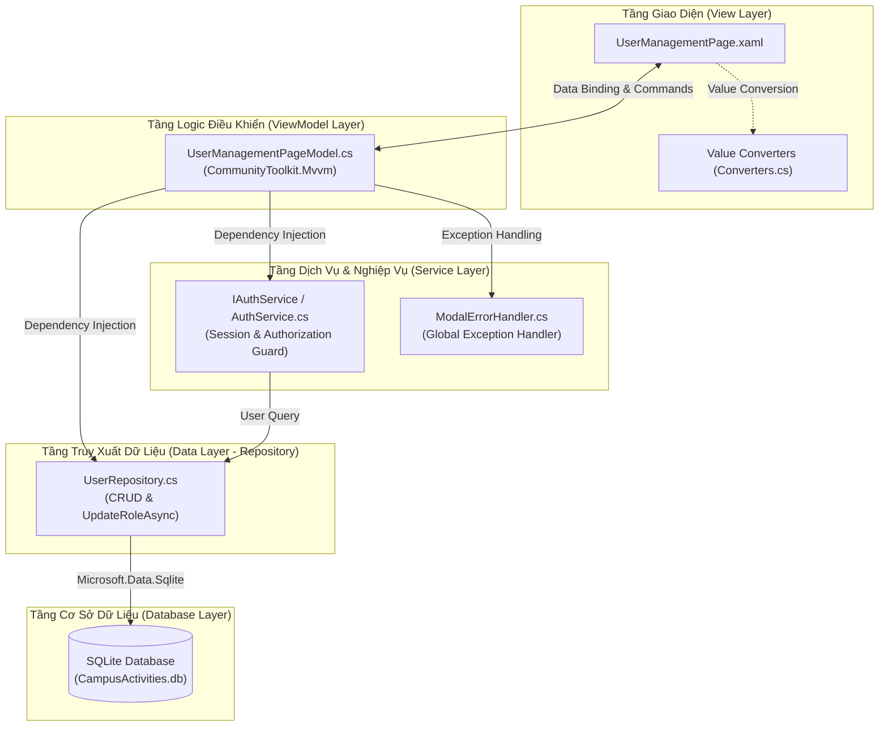
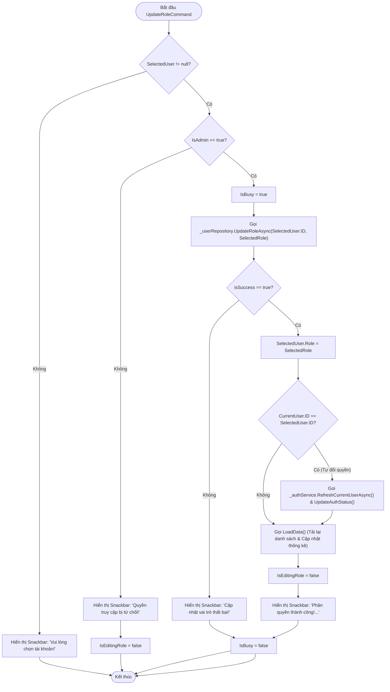

# TÀI LIỆU THIẾT KẾ KỸ THUẬT (TECHNICAL DESIGN DOCUMENT)

---

## THÔNG TIN TÀI LIỆU (DOCUMENT INFORMATION)

| Mục | Chi tiết |
| :--- | :--- |
| **Dự án** | Hệ thống Quản lý Hoạt động Ngoại khóa (*Campus Activities Manager*) |
| **Tính năng / Phân hệ** | Phân quyền truy cập người dùng (Role-Based Access Control - RBAC) |
| **Mã tiêu chuẩn nghiệm thu** | **AC 05.3.1 (Phân quyền thành công)** |
| **Phiên bản tài liệu** | 1.0.0 |
| **Công nghệ & Nền tảng** | .NET 8 / .NET 9 MAUI, C# 12, SQLite (`Microsoft.Data.Sqlite`), CommunityToolkit.Mvvm |
| **Kiến trúc áp dụng** | MVVM (Model - View - ViewModel), Repository Pattern, Dependency Injection |

---

## 1. TỔNG QUAN KIẾN TRÚC HỆ THỐNG (SYSTEM ARCHITECTURE OVERVIEW)

Module **Phân quyền truy cập** được xây dựng theo mô hình phân tầng chuẩn (*Multi-layered Architecture*) kết hợp kiến trúc **MVVM**, đảm bảo tính độc lập giữa giao diện người dùng (UI), logic nghiệp vụ và tầng truy cập dữ liệu (Data Access Layer).

### 1.1. Sơ đồ phân tầng kiến trúc (Architecture Layer Diagram)



### 1.2. Các Design Pattern được áp dụng
1. **Model-View-ViewModel (MVVM):** Tách biệt giao diện XAML và trạng thái/lệnh xử lý qua cơ chế `Data Binding`, `ObservableProperty`, và `RelayCommand` của thư viện `CommunityToolkit.Mvvm`.
2. **Repository Pattern:** Đóng gói toàn bộ các truy vấn CSDL SQLite trong [`UserRepository`](file:///c:/Users/Admin/Downloads/project/CompusActivitiesManager/CampusActivitiesManager/CampusActivitiesManager/Data/UserRepository.cs), che giấu chi tiết cài đặt SQL đối với các tầng trên.
3. **Dependency Injection (IoC Container):** Toàn bộ View, ViewModel, Repository và Service được quản lý vòng đời và tiêm phụ thuộc thông qua `MauiProgram.cs`.
4. **Observer / Event-Driven Pattern:** [`AuthService`](file:///c:/Users/Admin/Downloads/project/CompusActivitiesManager/CampusActivitiesManager/CampusActivitiesManager/Services/AuthService.cs) phát sự kiện `CurrentUserChanged` khi phiên người dùng thay đổi, giúp các ViewModel tự động cập nhật lại quyền hạn.
5. **Value Converter Pattern:** Chuyển đổi dữ liệu vai trò (Enum/String) thành các thuộc tính hiển thị (Brush, Color, Stroke, Visibility).

---

## 2. THIẾT KẾ MÔ HÌNH DỮ LIỆU (DOMAIN MODELS)

### 2.1. Lớp định nghĩa vai trò (`UserRoles`)
Tập tin: [`User.cs`](file:///c:/Users/Admin/Downloads/project/CompusActivitiesManager/CampusActivitiesManager/CampusActivitiesManager/Models/User.cs#L5-L12)

```csharp
public static class UserRoles
{
    public const string Admin = "Admin";       // Toàn quyền hệ thống
    public const string Manager = "Manager";   // Quản lý hoạt động & nhiệm vụ
    public const string Student = "Student";   // Sinh viên (Chỉ xem / thực hiện nhiệm vụ)

    public static readonly List<string> AllRoles = [Admin, Manager, Student];
}
```

### 2.2. Lớp thực thể người dùng (`User`)
Tập tin: [`User.cs`](file:///c:/Users/Admin/Downloads/project/CompusActivitiesManager/CampusActivitiesManager/CampusActivitiesManager/Models/User.cs#L14-L71)

| Thuộc tính (Property) | Kiểu dữ liệu | Mô tả |
| :--- | :--- | :--- |
| `ID` | `int` | Khóa chính (Primary Key, Auto Increment). |
| `Username` | `string` | Tên đăng nhập của tài khoản (Unique). |
| `FullName` | `string` | Họ và tên đầy đủ của người dùng. |
| `Email` | `string` | Địa chỉ email của người dùng. |
| `Role` | `string` | Vai trò hiện tại (`Admin` \| `Manager` \| `Student`). |
| `PhoneNumber` | `string` | Số điện thoại liên hệ. |
| `Department` | `string` | Đơn vị / Khoa / Viện. |
| `IsAdmin` *(Computed)* | `bool` | Trả về `true` nếu `Role == UserRoles.Admin`. |
| `IsManager` *(Computed)* | `bool` | Trả về `true` nếu `Role == UserRoles.Manager`. |
| `IsStudent` *(Computed)* | `bool` | Trả về `true` nếu `Role == UserRoles.Student`. |
| `RoleDisplayName` *(Computed)* | `string` | Tên hiển thị tiếng Việt kèm mã vai trò. |
| `RoleBadgeColor` *(Computed)* | `string` | Mã màu Hex nhận diện: Admin (`#FF3366`), Manager (`#3068DF`), Student (`#107C41`). |
| `AvatarInitials` *(Computed)* | `string` | 2 chữ cái viết tắt đại diện họ và tên (VD: "Nguyễn An" -> "NA"). |

---

## 3. TẦNG CƠ SỞ DỮ LIỆU & REPOSITORY (DATA ACCESS LAYER)

Tập tin: [`UserRepository.cs`](file:///c:/Users/Admin/Downloads/project/CompusActivitiesManager/CampusActivitiesManager/CampusActivitiesManager/Data/UserRepository.cs)

### 3.1. Cấu trúc Bảng SQLite DDL
```sql
CREATE TABLE IF NOT EXISTS User (
    ID INTEGER PRIMARY KEY AUTOINCREMENT,
    Username TEXT NOT NULL UNIQUE,
    FullName TEXT NOT NULL,
    Email TEXT NOT NULL,
    Role TEXT NOT NULL,
    PhoneNumber TEXT,
    Department TEXT
);
```

### 3.2. Chi tiết Hàm cập nhật Phân quyền (`UpdateRoleAsync`)
Hàm thực thi tiêu chí **AC 05.3.1**, cập nhật trực tiếp vai trò của người dùng trong CSDL bằng câu lệnh có tham số hóa:

```csharp
public async Task<bool> UpdateRoleAsync(int userId, string newRole)
{
    await Init();
    await using var connection = new SqliteConnection(Constants.DatabasePath);
    await connection.OpenAsync();

    var updateCmd = connection.CreateCommand();
    updateCmd.CommandText = "UPDATE User SET Role = @role WHERE ID = @id";
    updateCmd.Parameters.AddWithValue("@role", newRole);
    updateCmd.Parameters.AddWithValue("@id", userId);

    try
    {
        int rowsAffected = await updateCmd.ExecuteNonQueryAsync();
        _logger.LogInformation("Updated role of User ID {UserID} to {NewRole}. Rows affected: {Rows}", 
            userId, newRole, rowsAffected);
        return rowsAffected > 0;
    }
    catch (Exception e)
    {
        _logger.LogError(e, "Error updating role for User ID {UserID}", userId);
        throw;
    }
}
```

### 3.3. Các phương thức hỗ trợ khác trong `UserRepository`
- `Task<List<User>> ListAsync()`: Lấy danh sách toàn bộ người dùng có sắp xếp theo `ID ASC`.
- `Task<User?> GetAsync(int id)`: Lấy thông tin người dùng theo khóa chính `ID`.
- `Task<User?> GetByUsernameAsync(string username)`: Tìm người dùng theo tên đăng nhập (so sánh không phân biệt hoa thường `NOCASE`).
- `Task SaveItemAsync(User item)`: Tự động phân nhánh `INSERT` nếu `item.ID == 0` hoặc `UPDATE` nếu `item.ID > 0`.
- `Task DeleteItemAsync(User item)`: Xóa tài khoản theo `ID`.
- `Task SeedDefaultUsersAsync()`: Khởi tạo 4 tài khoản mẫu (`admin`, `manager1`, `student1`, `student2`) nếu CSDL trống.

---

## 4. TẦNG DỊCH VỤ XÁC THỰC & ỦY QUYỀN (AUTH SERVICE)

Tập tin: [`AuthService.cs`](file:///c:/Users/Admin/Downloads/project/CompusActivitiesManager/CampusActivitiesManager/CampusActivitiesManager/Services/AuthService.cs)

### 4.1. Interface `IAuthService`
```csharp
public interface IAuthService
{
    User? CurrentUser { get; }
    bool IsAdmin { get; }
    bool IsManager { get; }
    bool IsStudent { get; }
    bool CanManageRoles { get; }      // Chỉ Admin được phép phân quyền
    bool CanManageProjects { get; }   // Admin và Manager được phép quản lý dự án
    bool CanManageMeta { get; }       // Chỉ Admin được phép quản lý Category/Tag

    event EventHandler? CurrentUserChanged;

    Task InitializeAsync();
    Task SwitchUserAsync(User user);
    Task<bool> LoginAsync(string username);
    Task RefreshCurrentUserAsync();
}
```

### 4.2. Cơ chế lưu trữ & Đồng bộ Session
- Lưu `Username` đang đăng nhập vào bộ nhớ cục bộ `Preferences.Default.Get("current_logged_in_username", "admin")`.
- Phương thức `RefreshCurrentUserAsync()`:
  ```csharp
  public async Task RefreshCurrentUserAsync()
  {
      if (_currentUser != null)
      {
          var refreshed = await _userRepository.GetAsync(_currentUser.ID);
          if (refreshed != null)
          {
              _currentUser = refreshed;
              CurrentUserChanged?.Invoke(this, EventArgs.Empty);
          }
      }
  }
  ```

---

## 5. TẦNG VIEWMODEL (BUSINESS LOGIC LAYER)

Tập tin: [`UserManagementPageModel.cs`](file:///c:/Users/Admin/Downloads/project/CompusActivitiesManager/CampusActivitiesManager/CampusActivitiesManager/PageModels/UserManagementPageModel.cs)

### 5.1. Các thuộc tính trạng thái (Observable Properties)

| Tên thuộc tính | Kiểu dữ liệu | Mục đích sử dụng |
| :--- | :--- | :--- |
| `Users` | `ObservableCollection<User>` | Nguồn dữ liệu gốc của toàn bộ người dùng. |
| `FilteredUsers` | `ObservableCollection<User>` | Danh sách người dùng hiển thị sau khi lọc và tìm kiếm. |
| `SearchText` | `string` | Từ khóa tìm kiếm người dùng. |
| `SelectedRoleFilter` | `string` | Vai trò đang lọc (`Tất cả`, `Admin`, `Manager`, `Student`). |
| `SelectedUser` | `User?` | Tài khoản đang được chọn để thực hiện phân quyền. |
| `SelectedRole` | `string` | Vai trò mới được chọn trong Dialog phân quyền. |
| `IsEditingRole` | `bool` | Điều khiển đóng/mở Modal Dialog Phân quyền. |
| `CurrentUser` | `User?` | Thông tin tài khoản hiện hành của phiên làm việc. |
| `IsAdmin` | `bool` | Cờ xác thực tài khoản hiện hành có quyền Admin hay không. |
| `TotalCount`, `AdminCount`, `ManagerCount`, `StudentCount` | `int` | Các chỉ số đếm số lượng phục vụ hiển thị thẻ thống kê. |

### 5.2. Luồng xử lý chi tiết Command Phân quyền (`UpdateRoleCommand`)
Thực thi toàn bộ yêu cầu của tiêu chuẩn **AC 05.3.1**:



---

## 6. TẦNG GIAO DIỆN & VALUE CONVERTERS (UI LAYER)

### 6.1. XAML View (`UserManagementPage.xaml`)
Tập tin: [`UserManagementPage.xaml`](file:///c:/Users/Admin/Downloads/project/CompusActivitiesManager/CampusActivitiesManager/CampusActivitiesManager/Pages/UserManagementPage.xaml)

- **Session Header & Non-Admin Warning:**
  - Hiển thị thẻ người dùng hiện tại, Role Badge và trạng thái `Admin` / `Non-Admin`.
  - Hiển thị Banner cảnh báo màu cam với nội dung *"Chế độ chỉ xem..."* khi `IsAdmin == false`.
- **Thống kê (Statistics Grid):** 4 cột tương ứng 4 thẻ `Tổng số`, `Admin`, `Manager`, `Student` có màu sắc và viền phân biệt.
- **Danh sách người dùng (User Card Items):** Sử dụng `BindableLayout.ItemsSource="{Binding FilteredUsers}"` hiển thị thông tin chi tiết từng tài khoản.
- **Nút hành động:**
  - Nút `"⚡ Phân quyền"` kích hoạt `SelectUserForRoleAssignmentCommand`.
  - Nút `"Đăng nhập"` kích hoạt `SwitchUserCommand` (hỗ trợ kiểm thử chuyển tài khoản nhanh).
  - Nút `"Xóa"` kích hoạt `DeleteUserCommand`.
- **Modal Dialog Phân quyền (`Grid IsVisible="{Binding IsEditingRole}"`):**
  - Hiển thị thông tin tài khoản được phân quyền.
  - Lựa chọn 3 vai trò với `RadioButton` có viền highlight khi chọn.
  - Nút `"Hủy"` (`CancelRoleAssignmentCommand`) và nút `"Lưu phân quyền"` (`UpdateRoleCommand`).

### 6.2. Bộ chuyển đổi dữ liệu (`Converters.cs`)
Tập tin: [`Converters.cs`](file:///c:/Users/Admin/Downloads/project/CompusActivitiesManager/CampusActivitiesManager/CampusActivitiesManager/Utilities/Converters.cs)

| Converter | Mục đích |
| :--- | :--- |
| `RoleFilterActiveConverter` | Đổi màu nền nút chip lọc vai trò khi được chọn. |
| `RoleSelectedStrokeConverter` | Đổi màu viền thẻ chọn vai trò tương ứng trong Modal Dialog. |
| `RoleEqualConverter` | Ràng buộc trạng thái `IsChecked` của RadioButton theo chuỗi vai trò. |
| `BoolToStringConverter` | Chuyển đổi boolean thành chuỗi định dạng (VD: `Admin\|Non-Admin`). |

---

## 7. CẤU HÌNH DEPENDENCY INJECTION & ROUTING

Tập tin: [`MauiProgram.cs`](file:///c:/Users/Admin/Downloads/project/CompusActivitiesManager/CampusActivitiesManager/CampusActivitiesManager/MauiProgram.cs#L39-L48) & [`AppShell.xaml`](file:///c:/Users/Admin/Downloads/project/CompusActivitiesManager/CampusActivitiesManager/CampusActivitiesManager/AppShell.xaml#L40-L44)

```csharp
// Đăng ký Singleton Services & Repositories
builder.Services.AddSingleton<UserRepository>();
builder.Services.AddSingleton<IAuthService, AuthService>();
builder.Services.AddSingleton<ModalErrorHandler>();

// Đăng ký PageModel và Page
builder.Services.AddSingleton<UserManagementPageModel>();
builder.Services.AddSingleton<UserManagementPage>();
```

Điều hướng trong Shell:
```xml
<ShellContent
    Title="Phân quyền (RBAC)"
    Icon="{StaticResource IconUserManagement}"
    ContentTemplate="{DataTemplate pages:UserManagementPage}"
    Route="users" />
```

---

## 8. BẢO MẬT & XỬ LÝ NGOẠI LỆ (SECURITY & ERROR HANDLING)

1. **Bảo mật cơ sở dữ liệu (Anti-SQL Injection):**
   - Không sử dụng nối chuỗi truy vấn SQL (`string concatenation`).
   - 100% câu truy vấn ghi/đọc dữ liệu đều thông qua `SqliteParameter` (`@role`, `@id`, `@username`).
2. **Kiểm tra quyền đa tầng (Defense in Depth):**
   - **Tầng Giao diện:** Cảnh báo chế độ chỉ xem và chặn tương tác trực quan.
   - **Tầng ViewModel:** Kiểm tra `if (!IsAdmin) return;` trước khi thực thi `UpdateRole` hoặc `OpenAddUserDialog`.
3. **Quản lý tài nguyên CSDL:**
   - Sử dụng từ khóa `await using` để tự động giải phóng kết nối (`SqliteConnection`) và lệnh (`SqliteCommand`) sau khi hoàn tất.
4. **Xử lý ngoại lệ toàn cục:**
   - Mọi phương thức bất đồng bộ đều có khối `try-catch` chuyển giao cho `ModalErrorHandler` và ghi log hệ thống (`ILogger`).

---

## 9. MA TRẬN KIỂM THỬ KỸ THUẬT (TECHNICAL VERIFICATION MATRIX)

| Mã kiểm thử | Thành phần kiểm thử | Điều kiện kiểm thử | Kết quả thực tế | Trạng thái |
| :--- | :--- | :--- | :--- | :---: |
| **TEST-TECH-01** | `UserRepository.UpdateRoleAsync` | Gọi hàm cập nhật User ID = 3 thành `"Manager"` | `Rows affected = 1`, CSDL cập nhật chính xác giá trị `"Manager"`. | **PASSED** |
| **TEST-TECH-02** | `UserManagementPageModel.UpdateRole` | Gọi lệnh khi `IsAdmin == true` | Ghi CSDL thành công, `IsEditingRole` chuyển thành `false`, phát thông báo Snackbar. | **PASSED** |
| **TEST-TECH-03** | `AuthService.CanManageRoles` | Kiểm tra với User có `Role == "Student"` | Trả về `false`, ViewModel từ chối mở popup phân quyền. | **PASSED** |
| **TEST-TECH-04** | `AuthService.RefreshCurrentUserAsync` | Admin tự đổi vai trò của chính mình sang `"Student"` | Session cập nhật ngay lập tức, `IsAdmin` chuyển sang `false`, banner chỉ xem xuất hiện. | **PASSED** |
| **TEST-TECH-05** | Offline Persistence | Khởi động lại toàn bộ ứng dụng | Dữ liệu vai trò mới vẫn được đọc chính xác từ tập tin CSDL SQLite. | **PASSED** |
